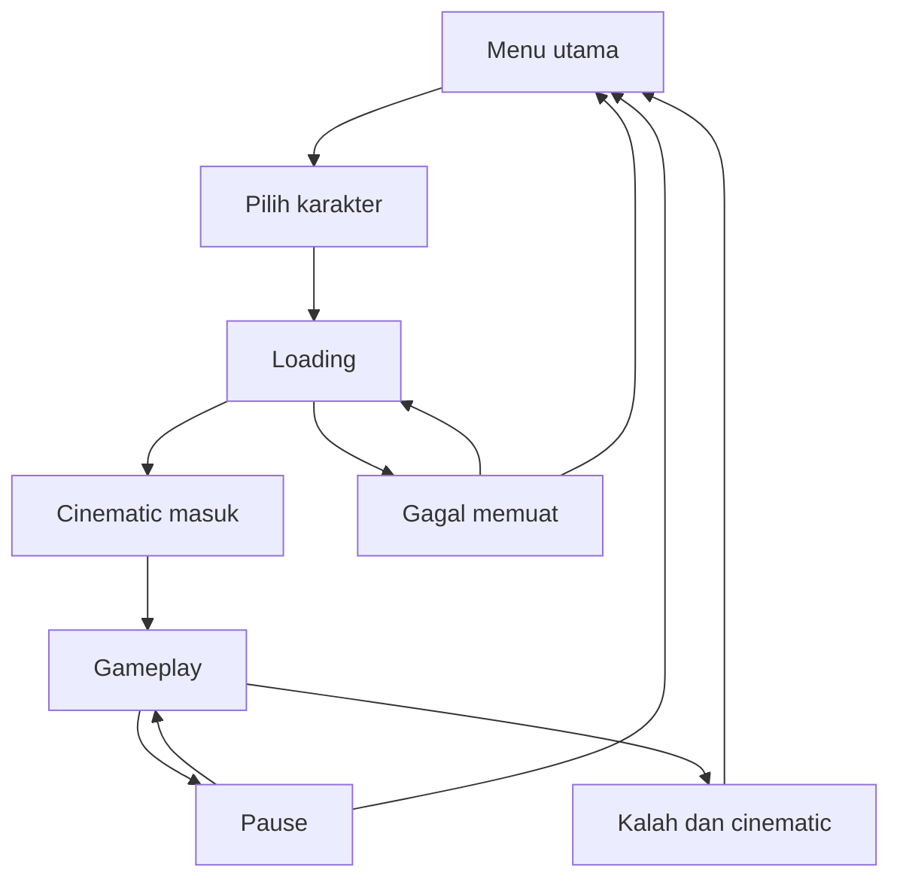

# Pendekarverse — Product Requirements Document

Versi: 1.0 • Tanggal: 29 September 2026 • Status: rancangan MVP untuk implementasi

Dokumen ini mendefinisikan game web 3D sederhana menggunakan Three.js. Ketentuan yang disebut pengguna menjadi requirement; detail yang belum ditentukan diberi label **Asumsi MVP**, **Target**, atau **Pertanyaan terbuka**. Semua angka gameplay adalah nilai awal untuk playtest, bukan hasil pengujian.

## 1. Ringkasan produk dan tujuan

> **Keputusan pengguna — 29 September 2026:** dua visual karakter dengan statistik sama; pertarungan tangan kosong; arah visual semi-realistis dengan haze dan lighting; desa Nusantara fiksi berarsitektur konsisten dengan rumah adat, gazebo/pendopo, rumah warga, plaza, gate/pura dan aksen Jawa. Kualitas visual dipilih sebelum mulai, dengan mode otomatis ringan pada ponsel dan adaptif pada desktop. Karakter prototipe menggunakan aset di folder `Characters`. Keputusan ini menggantikan asumsi senjata pendek dan low-poly pada rancangan awal di bawah. Detail implementasi serta batas validasi terdapat di README dan TEST_REPORT.

**Pendekarverse** adalah game aksi third-person single-player: pemain memilih pendekar, memasuki arena outdoor berupa hutan yang tersambung dengan desa Nusantara tempo dulu, melawan musuh, dan mengumpulkan poin selama masih hidup.

Pengalaman utama: buka website → Masuk → pilih karakter → Mulai → masuk arena → lawan musuh → karakter mati → kembali ke menu.

### 1.1 Tujuan

- Bisa langsung bermain melalui browser desktop maupun mobile dengan kontrol sederhana.
- Menghadirkan atmosfer hutan tropis dan pedesaan Indonesia tempo dulu dalam satu peta yang tersambung.
- Memberikan combat yang mudah dimengerti: mendekat, menyerang, menghindari serangan dengan bergerak, dan menjaga health.
- Mendukung penggantian karakter dengan model 3D full rigging milik pengguna.
- Memberikan gerakan kamera yang nyaman serta cinematic singkat tanpa mengganggu pertarungan.

### 1.2 Definisi dan asumsi utama

| Topik | Keputusan rancangan |
|---|---|
| Dungeon | Arena outdoor terbatas, bukan harus gua/bawah tanah; hutan dan desa berada dalam satu scene/map |
| Mode | **Asumsi MVP:** single-player survival tanpa batas waktu dan tanpa kondisi menang |
| Karakter | **Asumsi MVP:** dua karakter dapat dipilih; statistik dan mekanik sama, visual berbeda |
| Combat | **Asumsi MVP:** satu serangan melee dasar dengan senjata pendek; tidak ada combo atau skill |
| Kamera | Third-person follow dengan rotasi manual, bantuan recenter, cinematic masuk dan kalah |
| Gaya visual | **Asumsi MVP:** stylized low-poly, proporsi karakter menyesuaikan aset pengguna |
| Tema | Desa fiksi terinspirasi Nusantara pra-modern; bukan rekonstruksi periode/sejarah tertentu |
| Sesi | Dimulai dengan HP penuh dan skor nol; mati mengakhiri sesi |
| Akun | Tidak membutuhkan login maupun server gameplay |

## 2. Pengguna, ruang lingkup, dan indikator keberhasilan

### 2.1 Pengguna sasaran

Pemain kasual yang ingin mencoba game aksi pendek melalui tautan website, menggunakan keyboard/mouse atau layar sentuh. Sesi dirancang mudah dimulai ulang; target durasi sesi awal 3–10 menit untuk pemain baru, divalidasi melalui playtest.

### 2.2 Ruang lingkup

| Prioritas | Fitur |
|---|---|
| P0 — wajib rilis | Menu, pilih karakter, loading, satu peta tersambung, gerak/attack/loncat/sprint, health pemain dan musuh, spawn musuh, skor, mati lalu menu |
| P0 — wajib rilis | Kamera follow dan manual, cinematic masuk/kalah yang singkat, collision dunia, kontrol desktop dan mobile, pause, pengaturan dasar, pesan error |
| P0 — wajib rilis | Pipeline karakter rigged + animasi Mixamo, kualitas grafis rendah/standar, pengujian pada perangkat nyata |
| P1 — setelah loop stabil | Variasi musuh tambahan, variasi suara/VFX, tambahan prop dan dekorasi lingkungan |
| Di luar MVP | Multiplayer, akun, leaderboard online, inventory, equipment, crafting, quest, dialog NPC, boss, skill tree, combo, dodge roll, parry |
| Di luar MVP | Dunia procedural, banyak dungeon, interior rumah, day/night cycle, cuaca dinamis, monetisasi, cloud save, mode foto/free camera |

### 2.3 Target validasi produk

- Minimal 4 dari 5 peserta playtest baru bisa bergerak dan mengalahkan satu musuh dalam dua menit setelah spawn, tanpa bantuan verbal.
- Menu → sesi bermain → mati → menu → sesi baru dapat dijalankan berulang tanpa input macet, skor ganda, atau state tertinggal.
- Hutan dan desa dapat dicapai dengan berjalan tanpa pergantian halaman atau loading tambahan.
- Kontrol mobile tetap dapat digunakan saat gerak, kamera, dan tombol aksi dipakai bersamaan.
- Target performa dan kondisi perangkat dicatat pada bagian 7; angka tersebut harus dibuktikan sebelum rilis.

## 3. Journey dan perilaku layar

### 3.1 Alur utama

1. **Menu utama:** judul Pendekarverse, tombol **Masuk**, Pengaturan, panduan kontrol singkat, skor terakhir dan rekor lokal jika tersedia. Tidak ada form login.
2. **Pilih karakter:** kartu karakter, nama, preview 3D idle, pilihan sebelumnya terpilih kembali jika masih tersedia. Tombol **Mulai** aktif setelah karakter valid dipilih. Ada tombol Kembali.
3. **Loading:** memuat map, karakter pilihan, musuh, animasi dan aset penting. Gunakan progress per tahapan atau jumlah aset; jangan menampilkan persentase byte palsu. Gagal memuat menyediakan Coba Lagi dan Kembali.
4. **Spawn + cinematic masuk:** kamera memperlihatkan hubungan hutan dan desa, lalu bergerak ke belakang karakter. Durasi target 3–5 detik, dapat dilewati. Karakter belum menerima input gerak dan belum dapat diserang.
5. **Gameplay:** HUD aktif, grace period dua detik setelah kontrol tersedia, kemudian spawn musuh dimulai. Pemain bebas menjelajah, bertarung, dan mengumpulkan poin.
6. **Kalah:** HP mencapai nol, input gameplay dimatikan, AI/spawn berhenti, animasi death dan cinematic singkat diputar. Skor akhir ditampilkan sebagai overlay selama sekitar dua detik, lalu otomatis kembali ke menu.
7. **Menu setelah kalah:** skor terakhir dan rekor lokal diperbarui. Klik Masuk untuk memilih karakter dan memulai sesi baru.

### 3.2 State tambahan

| Kondisi | Perilaku |
|---|---|
| Pause manual | Bekukan simulasi, animasi gameplay, spawn dan timer; tampilkan Lanjut, Pengaturan, Kembali ke Menu |
| Kembali ke Menu saat hidup | Konfirmasi meninggalkan sesi; sesi dianggap dibatalkan dan tidak memperbarui rekor |
| Tab tersembunyi / jendela kehilangan fokus | Auto-pause, hapus semua input yang sedang ditahan; kembali harus klik Lanjut |
| Mobile berubah portrait saat bermain | Pause dan tampilkan permintaan putar ke landscape; tidak mengandalkan orientation lock |
| Refresh halaman | Sesi aktif hilang; buka kembali menu; hanya setting dan skor lokal tersimpan |
| Asset karakter gagal | Tampilkan error pada karakter terkait; pengguna boleh pilih karakter lain atau retry |
| WebGL 2 tidak tersedia | Pesan perangkat/browser belum mendukung; jangan biarkan layar hitam |
| WebGL context hilang | Pause dan tampilkan pemulihan/reload; skor sesi tidak dijanjikan dapat dipulihkan |

## 4. Gameplay, kontrol, musuh, dan skor

### 4.1 Kontrol desktop dan mobile

| Aksi | Desktop | Mobile landscape |
|---|---|---|
| Jalan | W/A/S/D; panah sebagai alternatif | Analog virtual kiri |
| Putar kamera | Drag tombol mouse kanan; alternatif drag mouse kiri pada area dunia | Swipe/drag area kanan di luar tombol aksi |
| Attack | Klik kiri singkat atau J | Tombol Attack besar di kanan bawah |
| Loncat | Space | Tombol Loncat di dekat Attack |
| Sprint | Tahan Shift selama bergerak | Tombol Sprint toggle; indikator menyala saat aktif |
| Recenter kamera | R | Tombol kamera kecil |
| Pause | Esc atau P | Tombol pause kanan atas |
| Lewati cinematic | Space atau tombol Lewati | Tombol Lewati |

**Aturan input:**

- Gerak relatif terhadap arah horizontal kamera. Karakter menghadap arah gerak, kecuali selama attack.
- Desktop membedakan klik kiri attack dari drag kiri kamera dengan ambang gerak awal 6 CSS px. Drag tidak memicu attack; keyboard J tetap dapat menyerang saat kamera digerakkan. Tidak ada kewajiban pointer lock.
- Matikan context menu hanya pada canvas game untuk drag kanan; jangan mengubah perilaku browser di seluruh halaman.
- Normalisasi gerak diagonal agar tidak lebih cepat. Analog mendukung intensitas, dead zone awal 0,15.
- Pointer analog, kamera, dan tombol aksi dikelola terpisah; jari yang memulai suatu kontrol tetap memiliki kontrol itu hingga dilepas/dibatalkan.
- Tombol aksi tidak menggerakkan kamera. Area game mencegah scroll/pinch browser selama bermain; menu tetap dapat diakses normal.
- Bersihkan input pada pointercancel, blur, pause dan keluar sesi agar karakter tidak terus berjalan.
- Sprint toggle mobile kembali mati saat pause, mati, atau sesi baru. Saat berhenti berjalan status tetap terlihat dan berlaku lagi ketika bergerak.
- Tombol sentuh minimal 48 × 48 CSS px; Attack ditargetkan 64–80 px. Hormati safe area perangkat.

### 4.2 Parameter awal pemain

| Parameter | Default untuk playtest |
|---|---:|
| HP maksimum | 100 |
| Kecepatan jalan | 3,5 meter/detik |
| Kecepatan sprint | 6 meter/detik |
| Tinggi loncat | Sekitar 1 meter |
| Damage attack | 25 |
| Jangkauan attack | 1,8 meter dari karakter |
| Sudut area attack | 90° di depan karakter |
| Durasi attack | 0,65 detik |
| Wind-up / active / recovery | 0,15 / 0,15 / 0,35 detik |
| Kekebalan sesaat setelah menerima damage | 0,45 detik |

Semua parameter disimpan di konfigurasi dan diselaraskan dengan clip animasi setelah aset diterima.

**Aturan gerak:** capsule collider sederhana, gravitasi, grounded check, collision dengan tanah/rumah/pohon/batu. Tidak ada double jump. Loncat hanya dari tanah dan tidak memberikan kekebalan; pemain masih bisa terkena serangan jika volume serangan beririsan. Tidak ada stamina, fall damage, regenerasi HP maupun potion pada MVP. Jika jatuh keluar batas akibat bug, pindahkan ke posisi aman terakhir tanpa memberi skor atau mengembalikan HP.

### 4.3 Combat

- Satu tap atau klik menghasilkan satu attack; menahan tombol tidak auto-attack. Satu input berikutnya boleh disimpan pada 0,15 detik terakhir recovery; input lain diabaikan.
- Saat attack, sprint berhenti sementara dan gerak menjadi 35% kecepatan jalan. Loncat tidak dapat dimulai ketika attack berlangsung; attack saat airborne diabaikan pada MVP.
- Soft aim memilih musuh terdekat dalam jangkauan dan kerucut depan, maksimal koreksi arah 30°. Tidak ada lock-on permanen dan tidak memutar kamera otomatis.
- Damage hanya aktif selama hit window. Maksimal satu musuh terkena per attack dan maksimal sekali untuk setiap attack ID.
- Pemeriksaan memakai jarak, arah, overlap vertikal dan penghalang dunia; senjata tidak bisa memukul menembus rumah/pohon solid.
- Feedback: reaksi singkat, kilatan material, bunyi hit dan penurunan health. Hindari gore; efek visual harus terbaca pada layar kecil.
- Hurt animation tidak boleh menimbulkan stun permanen. Death selalu memiliki prioritas tertinggi.

### 4.4 Musuh dan AI

**Asumsi MVP:** satu tipe musuh humanoid fiksi, misalnya bandit desa, dengan satu serangan melee. Model dapat digunakan berulang dengan variasi warna ringan. Tidak perlu ranged enemy atau boss.

| Parameter musuh | Default untuk playtest |
|---|---:|
| HP | 75 |
| Damage | 10 |
| Kecepatan mengejar | 2,5 meter/detik |
| Radius mendeteksi pemain | 12 meter |
| Jangkauan attack | 1,4 meter |
| Interval minimum antar attack | 1,4 detik |
| Wind-up yang terlihat | 0,45 detik |
| Poin per kill | 100 |

State AI: Spawn → Idle/Patrol → Chase → Attack → Recovery; Hurt dapat memotong aksi sesuai aturan; HP nol masuk Dead. AI dapat kembali mengejar setelah recovery. Gunakan jarak deteksi dan line-of-sight; setelah kehilangan pemain lebih dari lima detik, kembali ke titik patroli yang valid.

Navigasi menggunakan graph waypoint sederhana yang dipasang mengikuti jalan dan area terbuka, dengan pencarian A* saat jalur perlu diperbarui. Direct steering hanya jika jalur bebas. Musuh memakai collision dan separation agar tidak menembus bangunan atau bertumpuk. Maksimal dua musuh boleh memulai attack pada saat yang sama di dekat pemain; sisanya mengambil posisi mendekat/menunggu.

Musuh yang tidak berhasil bergerak selama tiga detik mencoba jalur ulang. Bila tetap macet selama sepuluh detik, musuh boleh dihapus dan dijadwalkan ulang tanpa poin, hanya di luar pandangan pemain.

### 4.5 Spawn director

- Pada awal gameplay, munculkan dua musuh, berjarak setidaknya 10 meter dari pemain, setelah grace period berakhir.
- Berikutnya evaluasi spawn setiap empat detik: spawn satu musuh apabila jumlah hidup di bawah batas. Target awal maksimum enam musuh; setelah menit ketiga menjadi delapan dan tidak meningkat lagi pada MVP.
- Batas gameplay sama untuk semua preset grafis. Kualitas rendah mengurangi biaya visual, bukan jumlah musuh atau damage.
- Spawn hanya di titik yang dirancang sebelumnya pada tanah walkable; kandidat harus berjarak 10–22 meter dari pemain, tidak bertabrakan, dan mempunyai jalur menuju area pemain.
- Utamakan titik di luar frustum kamera. Jika tidak ada titik yang memenuhi syarat, tunda spawn tanpa memaksa spawn di depan pemain atau menumpuk antrean.
- Spawn diberi efek sederhana sekitar 0,5 detik; belum dapat menyerang/ditargetkan sampai siap.
- Bangkai hilang setelah sekitar dua detik. Batasi objek aktif dan gunakan ulang instance musuh jika sesuai.
- Spawn berhenti saat cinematic, pause, kalah, dan keluar arena. Tidak ada spawn di menu.

### 4.6 Health, skor, dan akhir sesi

- Health pemain selalu terlihat di HUD beserta angka, misalnya 75/100, dan bar kecil di atas karakter.
- Musuh hidup memiliki health bar di atas kepala ketika berada di layar dan maksimal 15 meter dari kamera; bar tersembunyi jika terhalang objek solid. Jangan render bar untuk musuh mati atau di belakang kamera.
- HP dibatasi pada rentang 0 sampai maksimum. Setiap musuh hanya menghasilkan satu event kill.
- Skor sesi = jumlah musuh yang dibunuh × 100. Tidak ada poin dari musuh yang sekadar despawn, sesi dibatalkan, atau objek lingkungan.
- Jika pemain dan musuh mati pada tick simulasi yang sama, selesaikan damage dan kill pada tick itu dahulu; skor tersebut masuk hasil akhir. Setelah sesi berstatus kalah, tidak ada damage atau skor lanjutan.
- Menu menampilkan skor terakhir, jumlah kill dan rekor lokal. Rekor hanya untuk perangkat/browser tersebut dan dapat dihapus pengguna; bukan skor terverifikasi.
- Run baru mereset HP, skor, timer, posisi, musuh dan semua status combat.

## 5. Dunia, visual, kamera, dan audio

### 5.1 Peta tersambung

**Asumsi MVP:** satu peta statis sekitar 120 × 120 meter, disesuaikan setelah blockout. Tata letak membentuk jalur melingkar yang menghubungkan hutan, transisi kebun/jalan setapak dan desa, dengan satu jalur pendek kembali ke titik awal. Tidak memakai portal atau loading antarzona.

| Zona | Elemen utama | Fungsi gameplay |
|---|---|---|
| Tepian hutan | Tanah lapang, batu penanda, pepohonan | Spawn pemain dan orientasi awal |
| Hutan tropis | Bambu, pakis, pohon besar, akar, batu, semak | Pertarungan di ruang terbuka di antara vegetasi |
| Jalur transisi | Jalan tanah, kebun, pagar bambu, sungai kecil/jembatan sederhana | Hubungkan kedua area dan beri petunjuk arah alami |
| Desa | 5–8 rumah kayu/bambu, atap genteng/ijuk sesuai referensi, halaman, sumur, balai sederhana, gerobak | Ruang tempur lebih luas dan identitas visual utama |

- Rumah hanya eksterior; pintu tertutup atau tidak interaktif. Sungai bersifat dekoratif dengan batas collision; belum ada berenang.
- Jalan utama cukup untuk pemain dan dua musuh berpapasan; hindari lorong sempit dan titik kamera terjepit.
- Batas map berupa lereng, batu atau vegetasi rapat dengan collider yang konsisten. Tidak membuat dinding tak terlihat di tengah jalur yang tampak bisa dilalui.
- Pohon dan rumah solid punya collider sederhana; daun, rumput dan dekorasi kecil tidak menghambat gerak.
- Siluet, warna, lampu dan penanda lingkungan membedakan jalur. Minimap tidak diperlukan untuk arena sekecil ini.
- Gunakan satu bahasa arsitektur dominan agar desa terasa konsisten. **Pertanyaan terbuka:** wilayah referensi dan periode spesifik, jika diinginkan pengguna.

### 5.2 Art direction dan UI

Warna tanah hangat, hijau tropis, cahaya sore lembut dan kabut tipis untuk kedalaman. Karakter serta musuh harus menonjol dari latar; hindari detail daun yang menutupi musuh. Ornamen UI dapat memakai motif Nusantara secara terbatas, dengan font isi yang mudah dibaca dan lisensinya jelas.

HUD: HP pemain kiri atas, skor/kill dekat bagian atas, pause kanan atas. Analog kiri bawah dan cluster aksi kanan bawah hanya terlihat pada touch mode. Petunjuk kontrol desktop tampil singkat pada sesi pertama dan dapat dibuka lagi melalui pause. Tidak menempatkan panel besar di tengah layar saat bertarung.

### 5.3 Kamera gameplay

| Aspek | Ketentuan awal |
|---|---|
| Posisi | Third-person sekitar 4,5 meter di belakang karakter; titik pandang sekitar dada/kepala |
| Rotasi | Yaw bebas; pitch dibatasi sekitar −15° sampai +55° relatif arah horizontal, untuk mencegah sudut ekstrem |
| Follow | Damping berbasis delta time; tidak bergetar saat langkah, lereng atau perubahan FPS |
| Recenter | Setelah dua detik bergerak tanpa input kamera, perlahan kembali di belakang arah gerak; input manual langsung membatalkan bantuan |
| Collision | Uji sphere/collision sweep dari target ke posisi kamera; dekatkan kamera saat ada dinding, lalu pulihkan jarak dengan halus |
| Kamera terlalu dekat | Karakter boleh dibuat transparan sementara agar tidak menutupi pandangan |
| Sprint | Perubahan FOV ringan, misalnya 60° → 65°, tanpa guncangan berlebihan |
| Kenyamanan | Slider sensitivitas; opsi invert Y, camera shake on/off, dan reduced motion |

### 5.4 Cinematic

- **Menu:** pergerakan latar sangat lambat atau gambar statis pada perangkat rendah.
- **Pilih karakter:** preview idle dengan orbit pelan; pengguna dapat drag untuk memutar preview.
- **Masuk arena:** lintasan kamera yang sudah dirancang menampilkan hutan dan desa lalu menyatu dengan posisi kamera gameplay. Simulasi musuh belum berjalan.
- **Kalah:** kamera melambat/dekat sedikit selama sekitar dua detik sambil memperlihatkan karakter tumbang, kemudian fade ke menu. Tidak ada kill-cam otomatis tiap membunuh musuh.
- Tombol Lewati langsung menempatkan kamera pada posisi akhir yang valid. Cinematic kalah yang dilewati langsung menuju menu.
- Reduced motion mengganti lintasan panjang dan FOV sprint dengan transisi pendek serta menonaktifkan shake. Kualitas rendah tetap memiliki cinematic sederhana tanpa efek pascaproses berat.
- Cinematic harus memakai jalur yang telah diperiksa agar tidak melewati tanah, rumah atau pohon.

### 5.5 Audio

Ambience hutan/desa, langkah, ayunan senjata, impact, hurt, death dan musik latar ringan. Aktifkan audio setelah interaksi pengguna. Sediakan mute dan volume musik/SFX; pause meredam atau menghentikan audio gameplay. Audio gagal dimuat tidak boleh memblokir permainan; semua kejadian penting juga memiliki feedback visual.

## 6. Spesifikasi karakter, rigging, dan animasi Mixamo

### 6.1 File yang perlu disiapkan pengguna

| Kebutuhan | Format yang diminta | Catatan |
|---|---|---|
| Karakter sumber rigged | **FBX** | Sertakan mesh, deform skeleton, skin weights, bind pose; tekstur embedded atau folder terpisah |
| File kerja sumber | BLEND atau format DCC asli, opsional | Berguna untuk memperbaiki skinning, scale dan retarget |
| Tekstur | PNG/JPG; boleh dipaketkan dalam ZIP | Base color wajib; normal/roughness/metalness jika digunakan |
| Karakter runtime web | **GLB / glTF 2.0 binary** | Hasil final pipeline; mesh, rig, material dan animasi yang sudah dibake |
| Animasi dari Mixamo | FBX | Diekspor pada skeleton yang sesuai, lalu dibake dan dikonversi ke GLB |
| Senjata terpisah | GLB atau FBX | Mesh ringan dengan titik pegangan yang jelas |

**Rekomendasi pengiriman pertama:** satu karakter FBX + tekstur + pose referensi, untuk menguji seluruh pipeline sebelum semua karakter disiapkan. FBX adalah format sumber yang dipilih untuk kebutuhan rig; OBJ tidak menjadi format utama karena tidak membawa skeletal rig/animation yang dibutuhkan. Mixamo menerima upload FBX, OBJ dan ZIP menurut dokumentasi Adobe [S1].

### 6.2 Kontrak aset

- Humanoid biped, memiliki deform bones dan skin weights yang sudah diperiksa. Full rigging dengan control rig/IK tidak otomatis berarti animasinya siap diekspor; bake gerakan ke deform bones.
- T-pose atau A-pose yang konsisten, telapak kaki di permukaan tanah, origin/pivot pada pusat kaki.
- Konvensi runtime: 1 unit = 1 meter, Y-up dan forward karakter dinormalisasi ke +Z melalui pipeline/root wrapper.
- Scale dan transform dinormalisasi tanpa merusak bind pose. Uji gerakan bahu, siku, pinggul dan lutut.
- Tidak bergantung pada cloth simulation, hair simulation, constraint DCC atau shader khusus yang tidak dibake.
- Target awal karakter pemain 10–25 ribu triangles; musuh 5–12 ribu triangles; masing-masing idealnya 1–3 material, tekstur utama 1024 px. Ini budget desain, bukan batas format.
- Tulang tangan kanan atau socket senjata memiliki nama/mapping stabil. Collider combat mengikuti data gameplay; tidak memakai seluruh mesh skinned sebagai collider.

### 6.3 Pipeline produksi

1. Impor FBX sumber ke Blender/DCC dan periksa scale, skinning, rest pose serta struktur tulang.
2. Coba workflow Mixamo menggunakan karakter kompatibel. **Rig kustom tidak dijamin langsung cocok.** Jika skeleton berbeda, retarget animasi Mixamo ke rig karakter secara offline, koreksi pose dan bake hasilnya.
3. Ambil satu paket animasi dengan skeleton konsisten. Gunakan mode in-place untuk locomotion jika tersedia; jika tidak, hilangkan translasi root yang tidak diinginkan ketika baking.
4. Pertahankan gerakan vertikal tubuh yang diperlukan, tetapi perpindahan dunia dan loncat ditentukan controller. Hindari root motion ganda.
5. Sesuaikan genggaman senjata dan arah ayunan; tetapkan hit window berdasarkan animasi final.
6. Ekspor satu GLB per karakter dengan clip bernama konsisten. Optimalkan geometry/texture, lalu cek di Three.js.
7. Uji idle, locomotion, jump, attack, hurt dan death di desktop/mobile sebelum menyetujui aset.

Retarget dijalankan dalam pipeline aset, bukan setiap frame di browser. Jika karakter final belum tersedia, gunakan placeholder berlisensi jelas dengan interface clip yang sama.

### 6.4 Clip wajib

| Nama clip runtime | Fungsi | Loop |
|---|---|---|
| Idle | Berdiri/siap | Ya |
| Walk | Berjalan | Ya |
| Run | Sprint | Ya |
| Jump | Lepas landas/di udara | Tidak; pose udara dapat ditahan |
| Land | Mendarat; dapat diambil dari bagian akhir clip jump | Tidak |
| Attack_01 | Satu serangan melee | Tidak |
| Hit | Reaksi terkena damage | Tidak |
| Death | Tumbang; tahan pose akhir | Tidak |

AnimationMixer mengelola playback animasi karakter [S3]. Crossfade locomotion awal 0,1–0,2 detik; timing gameplay tidak hanya bergantung pada selesainya clip. Musuh yang memakai skeleton sama tetap mempunyai playback state independen. Prioritas: Death → Hit yang diizinkan → Attack → Jump/Land → Run/Walk → Idle.

## 7. Arsitektur teknis dan kualitas

### 7.1 Stack dan batas tanggung jawab

| Bagian | Pilihan rancangan |
|---|---|
| Bahasa/build | TypeScript + Vite; versi dependensi dikunci saat implementasi |
| Rendering | Three.js, WebGLRenderer, PerspectiveCamera |
| Aset 3D | GLTFLoader untuk GLB/glTF 2.0 [S2] |
| Animasi | AnimationMixer dan AnimationAction; clip final dibake offline |
| UI | HTML/CSS overlay; tidak wajib memakai framework UI besar |
| Collision | Controller capsule kinematik + collider statis sederhana; spatial query untuk broad phase |
| Navigasi | Graph waypoint statis + A* dan obstacle/separation steering |
| Persistence | localStorage untuk setting, karakter pilihan dan rekor lokal |
| Hosting | Build statis melalui HTTPS; aset satu origin atau CORS yang dikonfigurasi |
| Backend | Tidak diperlukan untuk scope MVP |

Three.js mengurus rendering dan menyediakan fasilitas animasi/loading; collision, AI, combat dan state game tetap harus diimplementasikan. WebGLRenderer saat ini membutuhkan WebGL 2, sehingga browser harus diuji untuk kapabilitas tersebut [S4].

### 7.2 Pembagian modul

| Modul | Tanggung jawab |
|---|---|
| GameStateManager | Menu, seleksi, loading, intro, bermain, pause, kalah dan transisi |
| AssetManager | Manifest, cache, progress, retry, ownership resource |
| InputManager | Keyboard, mouse, multi-touch, clear input dan action mapping |
| PlayerController | Gerak, gravitasi, grounded, sprint dan orientasi |
| WorldCollision / Navigation | Collider statis, query penghalang dan waypoint |
| CombatSystem | Hit window, damage, invulnerability, kill event dan skor |
| EnemySystem / SpawnDirector | AI, spawn budget, pooling dan cleanup |
| CameraController | Follow, orbit, collision, recenter dan cinematic |
| AnimationController | Mapping clip dan transisi state |
| HUD / Audio / Settings | Tampilan, audio dan preferensi |

Render mengikuti requestAnimationFrame. Simulasi memakai fixed timestep awal 1/60 detik, maksimal lima substep per frame; batasi delta setelah resume agar tidak terjadi teleport atau ledakan damage. Render dapat menginterpolasi posisi. Pause menghentikan waktu simulasi, bukan hanya gambar.

Setiap sesi memiliki ID dan owns state sendiri. Saat berakhir: hapus musuh, timer, input, audio sesi dan event listener terkait; reset mixer/action. Aset yang sengaja dicache boleh bertahan, resource yang tidak lagi dimiliki harus didispose. Jangan dispose geometry/material bersama yang masih dipakai instance lain. GLTFLoader juga mendokumentasikan perlunya penanganan khusus image bitmap saat disposal [S2].

### 7.3 Data konfigurasi minimum

- CharacterDefinition: id, nama, portrait, modelUrl, animationMap, weaponSocket, collider dimensions.
- EnemyDefinition: id, modelUrl, animationMap, maxHealth, speed, damage, detectionRange, attackRange, scoreValue.
- CombatConfig: timings, hit arc, hit range, input buffer, i-frames.
- WorldDefinition: modelUrl, spawn pemain, spawn musuh, collider, waypoint, bounds dan jalur cinematic.
- SessionState: sessionId, characterId, hp, score, kills, elapsedTime, activeEnemies dan status.
- UserSettings: schemaVersion, quality, sensitivity, invertY, reducedMotion, volume, bestScore dan lastCompletedRun.

Validasi config dan clip wajib saat load. Jika localStorage diblokir/penuh/rusak, gunakan default dan lanjut bermain; kegagalan menyimpan skor tidak boleh memutus sesi.

### 7.4 Target performa dan pemuatan

Semua angka berikut adalah **budget awal**, perlu diukur dengan aset final pada perangkat acuan yang disepakati.

| Ukuran | Mobile preset rendah | Desktop preset standar |
|---|---|---|
| Target gameplay | 30 FPS stabil; p95 frame time ≤40 ms | 60 FPS; p95 frame time ≤22 ms |
| Kondisi uji | 10 menit gameplay, termasuk desa dan 8 musuh hidup | Skenario yang sama pada 1080p |
| Render scale | DPR dibatasi 1–1,25; boleh diturunkan adaptif | DPR maksimal 1,5 |
| Shadow | Blob/baked shadow atau satu shadow murah | Satu directional shadow dengan cakupan terbatas |
| Postprocessing | Off | Minimal; tidak bergantung pada DOF/motion blur |
| Vegetasi | Instancing, density rendah, LOD/culling | Density sedang, tetap dibatasi |
| Budget draw call awal | ≤120 pada view terberat | ≤200 pada view terberat |

- Payload menu/seleksi awal target ≤5 MB transfer; aset tambahan untuk run pertama ≤20 MB. Karakter yang tidak dipilih dimuat on-demand; jangan unduh semua karakter resolusi penuh saat membuka menu.
- Target menu interaktif ≤5 detik dan Mulai → kontrol tersedia ≤20 detik pada uji cold cache, koneksi stabil 20 Mbps dengan latency sekitar 100 ms. Catat ukuran aset, perangkat dan hasil aktual.
- Optimasi awal: texture atlas, instancing pohon/prop, LOD, frustum culling, batasi lampu/material transparan, kompresi tekstur bila pipeline siap.
- Gunakan kompresi geometry hanya bila pengurangan transfer sebanding dengan biaya decode. Uji kompilasi shader/loading sebelum mengaktifkan gameplay.
- Benchmark pada minimal satu Android kelas menengah, satu iPhone yang ditargetkan dan satu laptop dengan GPU terintegrasi. Model/OS/browser exact dicatat sebelum performance sign-off; dukungan semua ponsel tidak dijanjikan.
- Matriks browser: Chrome Android, Safari iOS, Chrome/Edge desktop dan Safari macOS pada versi yang benar-benar diuji. Firefox dapat menjadi pengujian tambahan.
- Fullscreen bersifat opsional. Game tetap berfungsi dalam viewport browser biasa dan memperhitungkan address bar serta safe area.

### 7.5 Batas keamanan dan operasional

Tidak ada upload model oleh pemain publik, kredensial, pembayaran atau data pribadi pada MVP. Aset karakter disiapkan pengembang. Skor client-side dapat dimodifikasi dan tidak cocok untuk hadiah/kompetisi; leaderboard berhadiah membutuhkan desain server terpisah. Simpan catatan asal dan hak penggunaan aset/animasi/audio sebelum publikasi.

## 8. Acceptance criteria dan rencana pengujian

| ID | Skenario | Kriteria lulus |
|---|---|---|
| AC-01 | Journey utama | Masuk → pilih karakter → Mulai → loading → intro → gameplay berjalan pada desktop dan mobile |
| AC-02 | Pilihan karakter | Preview dan model spawn sesuai pilihan; pilihan tidak tersedia tidak bisa memulai |
| AC-03 | Konektivitas map | Pemain dapat pergi dari spawn hutan ke desa dan kembali tanpa loading, tembus batas atau stuck |
| AC-04 | Gerak | WASD/analog, sprint dan loncat berfungsi; diagonal tidak menambah kecepatan; tidak ada double jump |
| AC-05 | Multi-touch | Analog + kamera + attack/loncat bekerja bersamaan; release/pointercancel tidak menyisakan input |
| AC-06 | Damage | HP berkurang sesuai config hanya pada active window; satu attack tidak memberi damage ganda dan tidak menembus tembok |
| AC-07 | Health bar | HP pemain dan bar karakter terbaca; bar musuh mengikuti posisi serta aturan visibility |
| AC-08 | Skor | Tiga kill menghasilkan 300 poin; despawn tanpa kill tidak menambah skor; kill ganda tidak mungkin |
| AC-09 | AI dan spawn | Musuh mengejar melewati rute valid, tidak menembus rumah, dan jumlah hidup tidak melewati cap |
| AC-10 | Spawn aman | Tidak ada serangan saat intro/grace period; tidak ada spawn di tubuh pemain, bangunan atau titik tanpa jalur |
| AC-11 | Mati | HP nol menghentikan input/spawn, menampilkan death lalu otomatis kembali ke menu; tidak ada revive otomatis |
| AC-12 | Ulang sesi | HP/skor/musuh reset benar pada setiap run; lakukan 10 siklus tanpa listener/input berlipat atau resource count terus meningkat |
| AC-13 | Kamera | Rotasi mouse/touch, follow, recenter dan collision bekerja di tepi rumah/pohon/jembatan; tidak melewati tanah |
| AC-14 | Cinematic | Intro/death normal dan skip berakhir pada state tepat; tidak meninggalkan input terkunci |
| AC-15 | Pause/fokus/orientasi | Health, spawn dan timer berhenti; resume butuh aksi pengguna; portrait mobile tidak menyebabkan kematian diam-diam |
| AC-16 | Asset/rig | Tidak ada T-pose tak sengaja, root drift, senjata lepas atau clip hilang saat transisi |
| AC-17 | Error recovery | Gagal download, storage rusak dan WebGL tidak didukung memberi pesan jelas; retry loading tidak menggandakan sesi |
| AC-18 | Performa | Target section 7 diuji pada perangkat acuan; bila gagal, kurangi biaya aset/render dan ukur ulang sebelum sign-off |
| AC-19 | Konsistensi FPS | Kecepatan gerak, timing attack, damage dan spawn tidak berubah bermakna antara render 30 dan 60 FPS |
| AC-20 | Kenyamanan | Reduced motion, sensitivitas, audio dan safe area bekerja; HUD terbaca pada viewport landscape kecil |

Pengujian logika otomatis difokuskan pada damage satu kali, score satu kali, batas spawn, state pause/death/reset dan aturan timing. Playtest manual memvalidasi rasa kontrol, deformasi rig, kamera, jalur AI, multi-touch, landscape serta performa perangkat nyata. Dokumen ini belum menyatakan pengujian tersebut sudah dilakukan.

## 9. Tahapan implementasi, risiko, dan keputusan terbuka

### 9.1 Tahapan berdasarkan dependensi

| Tahap | Hasil | Gate sebelum lanjut |
|---|---|---|
| 1. Prototype controller | Three.js, arena blockout, kamera, gerak, sprint/loncat, kontrol desktop/mobile | Gerak dan multi-touch nyaman pada dua platform |
| 2. Combat loop | Satu musuh, health, attack, skor, spawn, mati dan menu | Satu run lengkap dapat diulang tanpa state bocor |
| 3. Validasi aset | Satu karakter pengguna + semua clip Mixamo dalam GLB | Rig/animasi/scale benar dan budget awal tercapai |
| 4. Map Nusantara | Hutan–desa, collider, waypoint, spawn dan art pass | Semua area terhubung, AI/kamera tidak stuck |
| 5. Presentasi | Karakter kedua, UI final, audio, cinematic, setting dan feedback | Journey dan seluruh fitur P0 lengkap |
| 6. Optimasi dan rilis | Profiling, uji browser/perangkat, perbaikan bug, build produksi | Acceptance P0 lulus dan catatan performa tersedia |

Estimasi kalender belum ditetapkan karena kualitas/jumlah aset, kompatibilitas rig dan kapasitas tim belum diketahui. Pekerjaan dapat dimulai dari blockout sebelum karakter final diterima.

### 9.2 Risiko utama

| Risiko | Dampak | Penanganan |
|---|---|---|
| Rig pengguna tidak cocok dengan Mixamo | Animasi rusak atau waktu produksi bertambah | Validasi satu karakter lebih awal; retarget dan bake offline |
| Hutan terlalu padat | FPS mobile turun dan musuh sulit terlihat | Batasi density, alpha overdraw dan shadow; pertahankan jalur tempur lapang |
| Kamera tersangkut desa | Pemain kehilangan orientasi | Collision kamera, jalan lebar, inspeksi sudut dekat bangunan |
| Musuh macet | Loop survival berhenti menarik | Waypoint valid, detection stuck dan respawn tanpa skor |
| Aset terlalu berat | Loading panjang atau tab ditutup sistem | Asset budget, load on-demand dan uji perangkat nyata sejak prototype |
| Kontrol touch berkonflik | Pemain tidak dapat bertarung sambil bergerak | Pointer ownership, zona input terpisah, tes 3 jari dan pointercancel |
| Survival terlalu sulit/mudah | Run terlalu singkat atau tidak menantang | Uji parameter; ubah cap/timing/damage melalui config dengan batas tetap |
| Citra desa tidak konsisten | Tema Indonesia terasa generik | Pilih satu referensi arsitektur dominan sebelum art pass final |

### 9.3 Pertanyaan terbuka tanpa menghambat prototype

1. Karakter final berapa, nama masing-masing, dan apakah kedua model berbagi skeleton? Default: dua visual dengan statistik sama.
2. Senjata utama: golok, pedang, tongkat, atau tangan kosong? Default prototype: senjata pendek placeholder; clip final mengikuti keputusan ini.
3. Gaya aset: low-poly stylized atau semi-realistis? Default: stylized, mengutamakan performa mobile.
4. Referensi desa: wilayah dan periode tertentu atau Nusantara fiksi? Default: desa fiksi dengan arsitektur dominan yang konsisten.
5. Perangkat minimum yang ditargetkan? Harus ditetapkan sebelum performance sign-off.

### 9.4 Definisi MVP selesai

MVP selesai ketika pengguna dapat membuka tautan, memilih karakter, menjelajahi satu arena hutan–desa yang tersambung, melawan musuh dengan empat aksi utama, melihat health dan skor, lalu otomatis kembali ke menu setelah kalah; semua ini berjalan pada perangkat mobile dan desktop acuan dengan kamera serta cinematic yang nyaman, tanpa bug kritis dan memenuhi acceptance criteria P0.

### Referensi teknis

Sumber diperiksa 29 September 2026. Sumber mendukung kapabilitas teknis yang disebut; parameter gameplay, budget dan pilihan arsitektur adalah rancangan Pendekarverse.

- **[S1] Adobe — Upload and rig 3D characters with Mixamo:** https://helpx.adobe.com/creative-cloud/help/mixamo-rigging-animation.html
- **[S2] Three.js — GLTFLoader:** https://threejs.org/docs/pages/GLTFLoader.html
- **[S3] Three.js — AnimationMixer:** https://threejs.org/docs/pages/AnimationMixer.html
- **[S4] Three.js — WebGLRenderer:** https://threejs.org/docs/pages/WebGLRenderer.html
